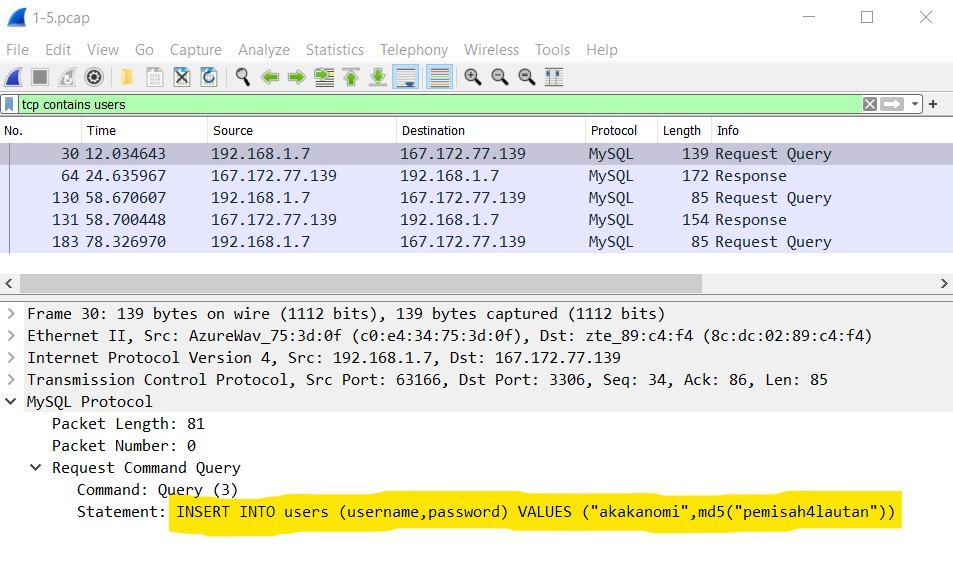

# Soal Shift Praktikum 1 Jarkom 2021

<li> Jonathan Timothy Siregar - 05111940000120
<li> Muhammad Fikri Sandi Pratama - 05111940000195
<li> Mohammad Thoriq Huda - 05111940000207
<br><br><br>

### 1. Webserver yang digunakan pada "ichimarumaru.tech"


### 2. Paket dari web-web yang menggunakan basic authentication method

Soal 2 meminta paket-paket apa saja yang berasal dari web-web yang menggunakan basic authentication method. Oleh karenanya digunakan filter `http.authbasic` pada file **1-5.pcap**. Hasil filternya ditampilkan pada gambar berikut.
  
  <br>
  <p align="center">
  
  <em>Hasil filter web dengan authentication method</em>
  <p> <br> <br>

### 3. Perintah di basic.ichimarumaru.tech

Soal 3 meminta untuk mengikuti perintah pada situs http://basic.ichimarumaru.tech setelah mendapatkan username dan password yang tepat untuk bisa login ke situs tersebut.
    Pencarian username dan password dilakukan dengan menggunakan filter `http.authbasic` pada file **1-5.pcap**. Berikut tampilannya.
    
  <br>
  <p align="center">
  
  <em>Hasil filter http.authbasic dan credentialsnya</em>
  <p> <br> <br>
    
Pada gambar di atas dapat kita lihat di kolom `Hypertext Transfer Protocol` > `Authorization` > `Credentials`, terdapat teks : <br>
    
        kuncimenujulautan:tQKEJFbgNGC1NCZlWAOjhyCOm6o3xEbPkJhTciZN

    
Sehingga disimpulkan bahwa kombinasi untuk masuk ke http://basic.ichimarumaru.tech ialah :
    
         Username : kuncimenujulautan
         Password : tQKEJFbgNGC1NCZlWAOjhyCOm6o3xEbPkJhTciZN
    
Setelah mengakses http://basic.ichimarumaru.tech dan memasukkan kombinasi di atas, terdapat halaman berikut yang meminta untuk mengisikan konfigurasi dari pengkabelan T568A. Berikut tangkapan layar laman tersebut beserta konfigurasi yang diminta.
    
  <br>
  <p align="center">
  
  <em>Laman http://basic.ichimarumaru.tech dan konfigurasi T568A</em>
  <p> <br> <br>
     

### 4 Paket mysql yang mengandung perintah query select

Soal 4 meminta untuk menemukan semua perintah query select yang terdapat pada **1-5.pcap**. Untuk itu, digunakan sebuah filter untuk menyaring mysql dan juga mengambil hanya perintah selectnya. Kedua filter tersebut dihubungkan dengan konjungsi `and`. Filter yang digunakan adalah `mysql.command == 3 and frame contains "SELECT"`. Berikut tampilan tangkapan layarnya.
    
  <br>
  <p align="center">
  
  <em>Hasil filter untuk menunjukkan query select mysql</em>
  <p> <br> <br>

### 5. Perintah di portal.ichimarumaru.tech

Soal 5 meminta untuk mengikuti perintah pada situs http://portal.ichimarumaru.tech setelah mendapatkan username dan password yang tepat untuk bisa login ke situs tersebut.
    Pencarian username dan password dilakukan dengan menggunakan filter `tcp contains users` pada file **1-5.pcap**. Berikut tampilannya.
    
  <br>
  <p align="center">
  
  <em>Hasil filter tcp contains users, username, dan passwordnya</em>
  <p> <br> <br>
    
Pada gambar di atas dapat kita lihat di kolom `MySQL Protocol` > `Request Command Query` > `Statement`, terdapat teks : <br>
    
        INSERT INTO users (username,password) VALUES ("akakanomi",md5("pemisah4lautan"))

    
Sehingga disimpulkan bahwa kombinasi untuk masuk ke http://portal.ichimarumaru.tech ialah :
    
         Username : akakanomi
         Password : pemisah4lautan
    
Setelah mengakses http://portal.ichimarumaru.tech dan memasukkan kombinasi di atas, terdapat halaman berikut yang meminta untuk mengisikan konfigurasi dari pengkabelan T568B. Berikut tangkapan layar laman tersebut beserta konfigurasi yang diminta.
    
  <br>
  <p align="center">
  
  <em>Laman http://portal.ichimarumaru.tech dan konfigurasi T568B</em>
  <p> <br> <br>

### 6


### 7


### 8


### 9


### 10. "history.txt" dan password pembuka secret.zip
    
Soal no 10 meminta untuk mencari password pembuka **secret.zip** yang ada di dalam **history.txt**. Untuk itu kita mencari isi dari **history.txt** pada file **8-10.pcap** dengan menggunakan filter `ftp-data.command contains history.txt`. Setelah itu klik kanan pada paket yang tertera, pilih follow TCP Stream. Berikut hasil tangkapan layarnya.
    
  <br>
  <p align="center">
  
  <em>Isi paket history.txt melalui follow TCP Stream</em>
  <p> <br> <br>
    
Di dalamnya terdapat suatu baris berisi
        `key="$(tail -1 bukanapaapa.txt)"`
sehingga diasumsikan, password sebenarnya terdapat pada file **bukanapaapa.txt**
    
Langkah berikutnya yaitu mencari paket yang mengandung **bukanapaapa.txt** dengan menggunakan filter `ftp-data.command contains bukanapaapa.txt`. Lakukan hal yang sama seperti pada **history.txt** yakni klik kanan pada paket yang tertera, pilih follow TCP Stream. Berikut hasil tangkapan layarnya.
    
  <br>
  <p align="center">
  
  <em>Isi paket bukanapaapa.txt melalui follow TCP Stream</em>
  <p> <br> <br> 
    
Didapatkan pesan di dalam **bukanapaapa.txt** berupa :
        ```d1b1langbukanapaapajugagapercaya```
dimana pesan tersebut diasumsikan sebagai password dari file **Wanted.pdf** di dalam **secret.zip**. Dan ternyata benar saja, file **Wanted.pdf** dapat terbuka dengan menggunakan pesan di dalam **bukanapaapa.txt**. Berikut isi file **Wanted.pdf**.
    
  <br>
  <p align="center">
  
  <em>Isi file Wanted.pdf setelah memasukkan password 'd1b1langbukanapaapajugagapercaya'</em>
  <p> <br> <br> 

### 11


### 12


### 13


### 14


### 15
    
    
### Kendala yang dialami
    
<li> Pada soal nomor 4 terdapat permintaan dari asdos penguji untuk menggunakan filter yang lebih spesifik
<li> Terdapat username seijaku yang ternyata tidak dapat dipakai login di situs manapun
